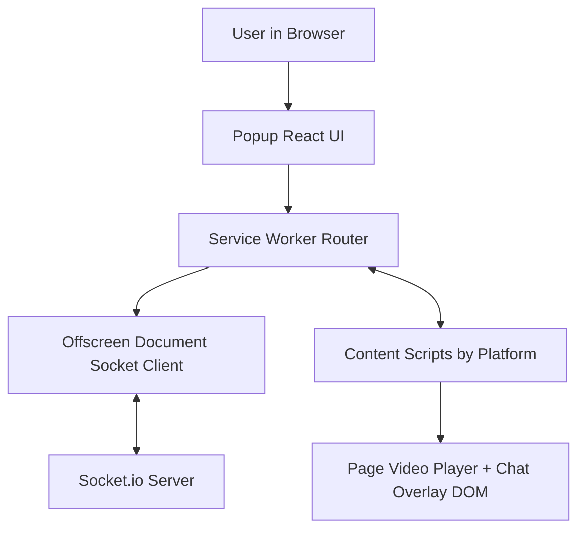
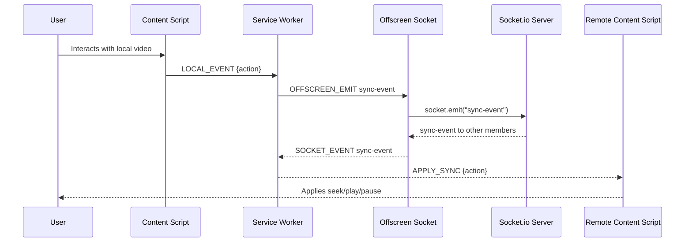
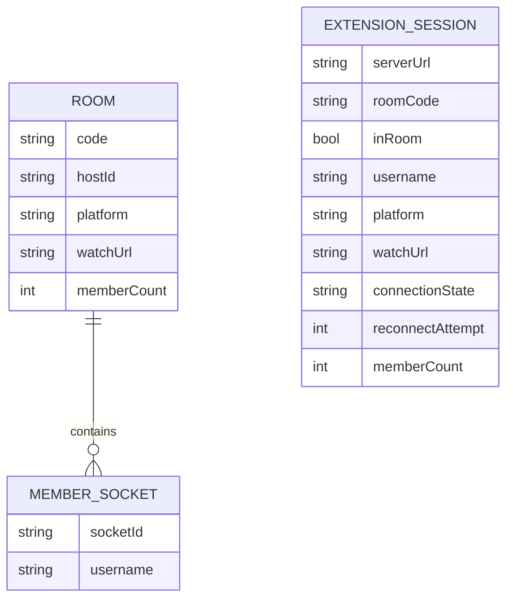

# Project Architecture & Context

> Architecture and workflow reference for human + AI-assisted development.
> Regenerate any time with the `/init-context` command.
> Last updated: 2026-05-17 · Commit: 82b8a43

## 1. Overview
- **What this project is:** WatchParty is a two-part system: a Chrome Manifest V3 extension and a Node.js + Socket.io relay server that synchronizes playback events and chat across supported video platforms. The extension uses a four-layer design (Popup UI, Service Worker router, Offscreen Document socket client, and per-site content scripts) to keep sync active even when the popup is closed, and now supports invite redirects that open the same OTT title and auto-join guests into the room (`extension/manifest.json`, `extension/src/popup/App.jsx`, `extension/src/background/service-worker.js`, `extension/src/offscreen/offscreen.js`, `server/index.js`).
- **Purpose / domain:** It solves synchronized remote video watching for small groups by relaying play/pause/seek/ad/chat events in real time and locking each room to one platform (`server/index.js`, `extension/src/content/youtube.js`, `extension/src/content/netflix.js`, `extension/src/content/prime.js`, `extension/src/content/hotstar.js`).
- **Repo type:** service + client (one server package + one extension package) (`server/package.json`, `extension/package.json`).

## 2. Tech Stack
| Layer | Technology | Version | Notes |
|-------|-----------|---------|-------|
| Language | JavaScript (ES modules) | Not pinned in repo; README states Node 18+ | Both extension and server are JS-first (`README.md`, `server/package.json`, `extension/package.json`). |
| Framework | React + Express + Socket.io | React 18.2.0, Express 4.18.2, Socket.io 4.7.2 | React is popup UI only; backend is event-driven sockets (`extension/package.json`, `server/package.json`). |
| Runtime | Chrome Extension MV3 + Node.js | Chrome 109+ minimum; Node 18+ in docs | Offscreen API requires Chrome 109+ (`extension/manifest.json`, `README.md`). |
| Package manager | npm | lockfiles present per package | Separate dependency trees in `extension/` and `server/`. |
| Database / storage | In-memory Maps/Sets + `chrome.storage.local` | N/A | Server rooms are ephemeral in-memory; extension session state is persisted locally (`server/index.js`, `extension/src/background/service-worker.js`). |
| Key libraries | `@crxjs/vite-plugin`, `vite`, `vitest`, `socket.io-client`, `cors` | See package manifests | CRX plugin builds MV3 bundle; Vitest used in both packages (`extension/package.json`, `server/package.json`, `extension/vite.config.js`, `extension/vitest.config.js`). |

## 3. Architecture
**Style:** Event-driven service + extension clients with layered extension runtime components.

**Component map:**


**Components & responsibilities:**
| Component / Module | Path | Responsibility | Depends on |
|--------------------|------|----------------|------------|
| Popup UI | `extension/src/popup/App.jsx` | Setup/lobby/in-room UI; emits commands; renders state and socket events | `chrome.runtime` messaging, `parseInviteLink` |
| Popup bootstrap | `extension/src/popup/main.jsx` | React mount + error boundary | React/ReactDOM |
| Service Worker | `extension/src/background/service-worker.js` | Central message router; session owner; tab fan-out; offscreen lifecycle; keepalive alarm | `chrome.runtime`, `chrome.storage`, `chrome.tabs`, `chrome.offscreen`, `chrome.alarms` |
| Offscreen socket layer | `extension/src/offscreen/offscreen.js` | Long-lived Socket.io client; reconnect notifications; event bridge to SW | `socket.io-client`, `chrome.runtime` |
| Platform content scripts | `extension/src/content/*.js` | Detect video, emit local sync/ad/chat events, apply remote events, mount/unmount chat overlay | DOM APIs, `chrome.runtime`, `window.WatchPartyChat` |
| Shared ad detection helper | `extension/src/content/ad-detection.js` | MutationObserver-based ad state machine for Hotstar | DOM mutation APIs |
| Chat overlay | `extension/src/content/chat-overlay.js` | Injected input/toast/panel UI, local history, message send/receive glue | DOM APIs, `chrome.runtime` |
| Socket server | `server/index.js` | Room lifecycle, validation, platform lock, relay of sync/ad/chat/member events | Express, Socket.io, in-memory Maps/Sets |
| Server tests | `server/index.test.js` | Integration tests for room/sync/chat/ad/disconnect behavior | Vitest + `socket.io-client` |

## 4. Directory Structure
Annotated tree of the important folders only:
```
watchparty/
  extension/                     # Chrome MV3 extension package
    src/
      background/                # Service worker router and session state
      offscreen/                 # Persistent socket page/client
      popup/                     # React popup UI
      content/                   # Platform-specific player hooks + chat/ad logic
      lib/                       # Small shared popup utilities
    public/icons/                # Extension action icons
    manifest.json                # MV3 manifest and content script routing
    vite.config.js               # CRX/Vite build config
    vitest.config.js             # Extension test config (jsdom)
  server/                        # Node.js Socket.io relay service
    index.js                     # Express + Socket.io runtime
    index.test.js                # Server integration tests
    .env.example                 # Example env vars
  .cursor/skills/init/           # Local skill definition for /init
  README.md                      # User-facing run/setup and feature docs
```

## 5. Running the Project
| Task | Command | Notes |
|------|---------|-------|
| Install | `cd server && npm install` and `cd extension && npm install` | Separate installs per package (`README.md`). |
| Run (dev) | `cd server && npm run dev` and `cd extension && npm run dev` | Server uses `node --watch`; extension dev script is Vite build watch (`server/package.json`, `extension/package.json`). |
| Test | `cd server && npm test` and `cd extension && npm test` | Server tests run in Node env; extension tests run jsdom (`server/package.json`, `extension/vitest.config.js`). |
| Lint / type-check | > ⚠️ Unknown — needs human confirmation | No lint/typecheck scripts were found in package scripts. |
| Build | `cd extension && npm run build` | Produces `extension/dist/` for loading unpacked extension (`extension/package.json`, `README.md`). |
- **Prerequisites:** Node.js 18+, Chrome 109+, and an externally reachable server URL for sharing sessions (README uses ngrok) (`README.md`, `extension/manifest.json`).
- **Required env vars:** names only — see Section 8.

## 6. Core Workflows & Data Flow
For each core workflow, describe the end-to-end path.

**Primary flow: Playback sync relay (play/pause/seek)**

Step-by-step: entry → ... → response, referencing the real file at each step.
1. Local platform script binds `play`, `pause`, and `seeked` listeners and sends `LOCAL_EVENT` with `currentTime` unless `isSyncing` or ad is active (`extension/src/content/youtube.js`, same pattern in `netflix.js`, `prime.js`, `hotstar.js`).
2. Service worker receives `LOCAL_EVENT`, resolves sender tab platform, and forwards `OFFSCREEN_EMIT` `sync-event` payload with `roomCode`, `action`, `platform` (`extension/src/background/service-worker.js`).
3. Offscreen document emits the socket event only when connected (`extension/src/offscreen/offscreen.js`).
4. Server validates room membership and action shape, enforces platform lock, then broadcasts `sync-event` to all peers except sender (`server/index.js`).
5. Offscreen receives `sync-event` and forwards it to SW as `SOCKET_EVENT` (`extension/src/offscreen/offscreen.js`).
6. SW fans out `APPLY_SYNC` to supported tabs filtered by platform (`extension/src/background/service-worker.js`).
7. Remote content script applies seek/play/pause using `isSyncing` guard to avoid echo loops and uses a 2-second drift threshold before non-seek jumps (`extension/src/content/youtube.js`, equivalent logic in other platform scripts).

**Invite redirect auto-join flow:**
1. In-room host copies an invite link from popup, which requests a server invite token via SW + offscreen socket ack path (`extension/src/popup/App.jsx`, `extension/src/background/service-worker.js`, `extension/src/offscreen/offscreen.js`).
2. Server stores short-lived invite token mapped to active room watch URL and exposes `GET /invite/:token` redirect endpoint (`server/index.js`).
3. Invitee opens the invite URL; server redirects to OTT watch URL with invite metadata in query (`wp_room`, `wp_server`, `wp_platform`) (`server/index.js`).
4. OTT content script detects invite metadata and emits `INVITE_CONTEXT_DETECTED`; SW auto-connects to server and emits `join-room` in background (`extension/src/content/*.js`, `extension/src/background/service-worker.js`).
5. Content scripts continuously emit `WATCH_URL_CHANGED` while in room so server invite targets stay current when host navigates titles (`extension/src/content/*.js`, `extension/src/background/service-worker.js`).

## 7. Data Model
- Key entities and relationships:



- Where the schema lives; how migrations are created and run.
  - Server room data is runtime-only in memory via `Map`/`Set`/`Map` objects (`rooms`, `members`, `usernames`) in `server/index.js`.
  - No database schema files, ORM models, or migration system were found.
  - > ⚠️ Unknown — needs human confirmation: if any external persistence exists outside this repository.
- Client/server state management approach, if any.
  - Extension durable session state (`serverUrl`, `roomCode`, `inRoom`, `username`, `platform`, `watchUrl`) is stored in `chrome.storage.local` and restored on startup (`extension/src/background/service-worker.js`).
  - Server state is authoritative for room membership/event relay and now tracks per-room `watchUrl` plus short-lived invite token mappings while process is alive (`server/index.js`).

## 8. External Integrations & Environment
| Integration | Purpose | Where used (path) |
|-------------|---------|-------------------|
| Chrome Extension APIs (`runtime`, `tabs`, `storage`, `offscreen`, `alarms`) | Extension messaging, tab targeting, persisted session, persistent offscreen context, SW keepalive | `extension/src/background/service-worker.js`, `extension/src/offscreen/offscreen.js`, `extension/src/popup/App.jsx` |
| Socket.io | Bi-directional real-time relay for room/sync/chat/ad events | `server/index.js`, `extension/src/offscreen/offscreen.js` |
| OTT website DOMs (YouTube/Netflix/Prime/Hotstar) | Video element hooks and ad-state detection selectors | `extension/src/content/youtube.js`, `netflix.js`, `prime.js`, `hotstar.js`, `ad-detection.js` |
| ngrok URLs (special handling) | Forces websocket-only transport to avoid polling issues on ngrok tunnels | `extension/src/offscreen/offscreen.js` |

**Environment variables** (names + purpose only — never values):
| Variable | Purpose | Required? |
|----------|---------|-----------|
| `PORT` | Server listen port for Express/Socket.io | Optional (defaults to 3001 in code) (`server/index.js`, `server/.env.example`) |

## 9. Conventions & Patterns
- **Naming:** Message types are uppercase snake case (`POPUP_CONNECT`, `SOCKET_EVENT`, `AD_STARTED_REMOTE`) and socket events are kebab-case (`create-room`, `sync-event`) (`extension/src/background/service-worker.js`, `server/index.js`, `extension/src/offscreen/offscreen.js`).
- **Folder patterns:** New popup UI code belongs under `extension/src/popup/`; new transport/routing logic goes in SW/offscreen; per-platform playback hooks follow one-file-per-platform under `extension/src/content/`; server behavior is centralized in `server/index.js`.
- **Error handling:** Defensive guards and silent drop for malformed payloads are common on both extension and server sides (`safePayload`, room membership checks, null checks before DOM/video ops) (`server/index.js`, `extension/src/content/*.js`, `extension/src/popup/App.jsx`).
- **Logging:** Minimal logs; popup crash path logs via `console.error` in error boundary, server startup logs bind port via `console.log` (`extension/src/popup/main.jsx`, `server/index.js`).
- **Recurring patterns:** 
  - `isSyncing` flags prevent feedback loops during remote action apply (`extension/src/content/*.js`).
  - MutationObserver-based watchers for ad and video node lifecycle (`extension/src/content/*.js`, `extension/src/content/ad-detection.js`).
  - Platform lock is progressively assigned then enforced on join/sync/chat/ad flows (`server/index.js`).
  - SW as pure router (popup/content/offscreen never talk directly to server socket) (`extension/src/background/service-worker.js`, `extension/src/offscreen/offscreen.js`).

## 10. Build, CI & Deployment
- CI pipeline summary (triggers, stages).
  - > ⚠️ Unknown — needs human confirmation: no CI workflow files were found (`.github/workflows/` or equivalent absent from tracked files).
- How and where the project is deployed.
  - Server deployment target is not defined in repo; README documents local run and optional ngrok tunnel sharing (`README.md`).
  - Extension deployment docs cover unpacked local load from `extension/dist/` (`README.md`).
  - > ⚠️ Unknown — needs human confirmation: production hosting/distribution process.
- Containerization / infrastructure notes.
  - No `Dockerfile`, compose files, or IaC files were found in tracked files.

## 11. Testing
- Test framework(s) and where tests live.
  - Vitest is used in both packages (`server/package.json`, `extension/package.json`).
  - Server integration tests: `server/index.test.js`.
  - Extension unit tests: `extension/src/lib/parseInviteLink.test.js`, `extension/src/content/ad-detection.test.js`, `extension/src/content/hotstar.test.js`.
- How to run a single test.
  - Server example: `cd server && npx vitest run index.test.js -t "Room Creation"`.
  - Extension example: `cd extension && npx vitest run src/lib/parseInviteLink.test.js -t "valid https link returns serverUrl and uppercased roomCode"`.
- Coverage expectations, if defined.
  - README states "Tests: 28 passing" and lists covered areas but no coverage threshold config was found (`README.md`).
  - > ⚠️ Unknown — needs human confirmation: enforced coverage percentage thresholds.

## 12. Debugging Guide
- **Where logs go** and how to read them.
  - Server runtime logs print to terminal (`server/index.js`).
  - Popup runtime errors surface through `console.error` and fallback UI (`extension/src/popup/main.jsx`).
  - Content script/runtime message issues are observable via Chrome extension service worker and page devtools consoles (implied by use of runtime messaging in `extension/src/background/service-worker.js` and `extension/src/content/*.js`).
- **How to run in debug mode.**
  - Server: use `npm run dev` (`node --watch index.js`) for rapid restart while debugging (`server/package.json`).
  - Extension: use `npm run dev` in `extension/` for watch builds, then reload unpacked extension (`extension/package.json`, `README.md`).
  - > ⚠️ Unknown — needs human confirmation: any dedicated debugger launch configs beyond manual devtools.
- **Symptom → likely area** table:
| Symptom | Likely cause | First place to look |
|---------|--------------|---------------------|
| Popup says reconnecting / not connected | Socket connection issue, server URL mismatch, ngrok behavior | `extension/src/offscreen/offscreen.js`, `extension/src/popup/App.jsx` |
| Sync works on one platform but not another | Platform video/ad selectors stale after site UI changes | Matching script under `extension/src/content/` |
| Remote actions echo or jitter | `isSyncing` guard or seek threshold behavior | `extension/src/content/*.js` (`APPLY_SYNC` handlers) |
| Room join fails with platform lock error | Joining from different OTT domain than room platform | `server/index.js` (`join-room` platform validation) |
| Chat not visible after navigation | Overlay mount timing after SPA route change | `extension/src/content/*` `onNavigate` + `chat-overlay.js` |
| Room disappears after all users leave | 45s grace timer elapsed for empty room | `server/index.js` disconnect timeout logic |

## 13. Known Issues, Gotchas & Tech Debt
- README documents fragile DOM selector dependencies for ad detection and video hooks; OTT site changes can break behavior (`README.md`, `extension/src/content/*.js`, `extension/src/content/ad-detection.js`).
- Chat is not persisted across rejoins; local overlay history is capped to 20 messages in-memory (`README.md`, `extension/src/content/chat-overlay.js`).
- Server state is process-memory only; restarts drop all rooms (`server/index.js`).
- CORS is wide open (`origin: "*"`) in both Express and Socket.io with a code comment that it is dev-only and should be locked down for production (`server/index.js`).
- `TODO`/`FIXME`/`HACK`/`XXX` scan:
  - `TODO`: none found in tracked source.
  - `FIXME`: none found in tracked source.
  - `HACK`: none found in tracked source.
  - `XXX`: none found in tracked source.

## 14. Glossary
- **Popup:** Extension UI opened from toolbar; controls server URL, create/join, room actions (`extension/src/popup/App.jsx`).
- **Service Worker (SW):** MV3 background router that owns session state and fan-out (`extension/src/background/service-worker.js`).
- **Offscreen Document:** Hidden extension document that keeps the socket connection alive independent of popup lifecycle (`extension/src/offscreen/offscreen.html`, `extension/src/offscreen/offscreen.js`).
- **Content Script:** Per-platform script injected into OTT pages to hook video events and chat overlay (`extension/src/content/*.js`).
- **Room Code:** 6-character uppercase alphanumeric identifier generated server-side (`server/index.js`).
- **Platform Lock:** Room property that enforces all members/events to one supported platform (`server/index.js`).
- **isSyncing:** Client-side guard flag to prevent event feedback loops while applying remote actions (`extension/src/content/*.js`).

## 15. Playbook: Adding a New Feature
Concrete, ordered steps for *this* codebase — which files to create/touch, which patterns to follow, where to add tests, and how to verify the change.

1. Define the feature surface area:
   - Popup-only UI change: start in `extension/src/popup/App.jsx`.
   - Message-routing change: update `extension/src/background/service-worker.js`.
   - New socket event: update both `extension/src/offscreen/offscreen.js` and `server/index.js`.
   - Player/platform-specific behavior: edit or add `extension/src/content/<platform>.js`.
2. Extend message/event contracts consistently:
   - Add message type handlers in SW (`POPUP_*`, `SOCKET_EVENT`, `LOCAL_EVENT` family).
   - Add offscreen socket listeners/emitters for new event names.
   - Add server-side validation in `server/index.js` before broadcasting.
3. Preserve existing guardrails:
   - Keep platform lock checks for room-scoped events (`server/index.js` pattern).
   - Keep `isSyncing` / ad-state checks in content scripts to avoid loops.
   - Keep payload sanitization (`safePayload`, text trimming, username limits).
4. Add or update tests in the package you touched:
   - Server behavior -> `server/index.test.js`.
   - Extension logic -> add `*.test.js` under relevant `extension/src/**`.
5. Verify locally:
   - `cd server && npm test`
   - `cd extension && npm test`
   - `cd extension && npm run build`, reload unpacked extension, then manually validate flow in Chrome.
6. Update docs when behavior changes:
   - Refresh `README.md` user-visible setup/limitations.
   - Refresh `ARCHITECTURE.md` for architecture/data-flow changes.
